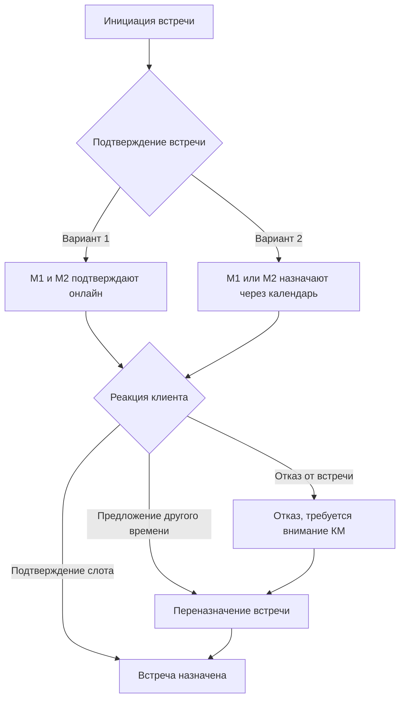

# Назначение встреч

К1 - Клиент первый (инициатор)	
М1 - Менеджер первого клиента (жертва)
К2 – Клиент второй 
М1 - Менеджер второго клиента
"светофор" - веб-приложение для менеджеров
"колокольчик" - страница уведомлений в веб-приложении
"монитор" - главная страница в веб-приложении
"онлайн-запросы" - страница в веб-приложении
"календарь" - инструмент в "онлайн-запросах"
разделы "Назначенные", "Запрошенные", "Архив" - подразделы во вкладке "Встречи и контакты" приложения
"Контроль" - кнопка в инструменте "онлайн-запросов". Это дополнительное подтверждение
  со стороны М1 назначения встречи. При нажатии на нее добавляется новая запись, 
  менеджеры видят все запросы клиентов, которые они должны обработать. Далее действия К2 либо 
  подтверждение, либо выбор и согласование новых дат и времени встречи.
"слот" - это заданные дата и время встречи: 10:00, 11:00, 12:00 и т.д. 
  При этом продолжительность не фиксируется.

Действие 1
К1 Инициация встречи в мобильном приложении.
- описание темы встречи
- выбор слотов

Индикация по Действию 1
У М1 и М2 (появляется)
- в разделе светофора (онлайн запросы)
- в светофоре монитора (у М1 и М2)
- в колокольчике светофора (сообщение)
- уведомление в почту (М1 и М2)

Контроль.

Действие 2 (вариант 1)
1.	М1 подтверждает онлайн
+
2.	М2 подтверждает онлайн
=

Действие 2 (вариант 2)
1.	М1 назначает встречу через календарь
      или
2.	М2 назначает встречу через календарь

Индикация на действие 2 (вариант 1)
- К2 получают push-уведомление что предложена встреча (пуш ведет в раздел Запрошенные)
- К1 и К2 получают на почту что предложена встреча
  М1 и М2 (колокольчик и почта) получают что предложена встреча
- у К2 индикация и выбор в разделе Запрошенные в приложении

Индикация на действие 2 (вариант 2)
У М1 и М2 (пропадает)
- в разделе светофора (онлайн запросы)
- в светофоре монитора (у М1 и М2)
  У М1 и М2 (появляется)
- в колокольчике светофора (сообщение)
- уведомление в почту (М1 и М2)
- встреча в разделе (онлайн встречи)
  - У К1 и К2 появляется
- встреча в приложении (Встречи\Назначенные)
- К1 и К2 получают пуш что назначена встреча (пуш ведет в раздел Назначенные)
- К1 и К2 получают на почту что назначена встреча

После Действия 2 (вариант 2)
Стоп

После Действия 2 (вариант 1)
Действие 3
К2
- подтверждает слот
- или не устраивает время
- или отказ от встречи

Индикация 1 на Действие 3
- если подтверждает слот
  К1 пуш и почта. «К2 принял ваше предложение о встрече…время и дата»
  Пуш ведет в раздел Назначенные
  М1 и М2 колокольчик и почта «К2 принял предложение К1 о встрече…время и дата
  Само сообщение подсветить зеленым

Индикация 1 на Действие 3 (продолжение)
Индикация +
У М1 и М2 (пропадает)
- в разделе светофора (онлайн запросы)
- в светофоре монитора (у М1 и М2)
  У М1 и М2 (появляется)
- встреча в разделе (онлайн встречи)
  -У К1 и К2 появляется
- встреча в приложении (Встречи\Назначенные)
- К1 и К2 получают пуш что назначена встреча (пуш ведет в раздел Назначенные)
- К1 и К2 получают на почту что назначена встреча

Индикация 1 на Действие 3 (продолжение)
Стоп

Индикация 2 на Действие 3
- если не удобно время
  М1 и М2 колокольчик и почта «К2 не согласовал с К1 время встречи. Требуется помощь КМ»
  Само сообщение подсветить желтым

Индикация 2 на Действие 3 (продолжение)
Индикация
У М1 и М2 (остаются)
- в разделе светофора (онлайн запросы)
- в светофоре монитора (у М1 и М2)
  У М1 и М2 (появляется)
- Индикация (в разделе онлайн запросы)
  «Требуется переназначение времени»

Индикация 2 на Действие 3 (продолжение)
Действие
3.	М1 назначает встречу через календарь
      или
4.	М2 назначает встречу через календарь

Индикация 2 на Действие 3 (продолжение)
Индикация
У М1 и М2 (пропадает)
- в разделе светофора (онлайн запросы)
- в светофоре монитора (у М1 и М2)
  У М1 и М2 (появляется)
- в колокольчике светофора (сообщение)
- уведомление в почту (М1 и М2)
- встреча в разделе (онлайн встречи)
  -У К1 и К2 появляется
- встреча в приложении (Встречи\Назначенные)
- К 1 и К 2 получают пуш что назначена встреча  (пуш ведет в раздел Назначенные)
- К 1 и К 2 получают на почту что назначена встреча

Индикация 2 на Действие 3 (продолжение)
Стоп

Индикация 3 на Действие 3
- если отказ от встречи
  М1 и М2 колокольчик и почта «К2 отказал К1 во встрече. Требуется внимание КМ»
  Само сообщение подсветить красным

Индикация 3 на Действие 3 (продолжение)
Индикация
У М1 и М2  (остаются)
- в разделе светофора (онлайн запросы)
- в светофоре монитора (у М1 и М2)
  У М1 и М2 (появляется)
- Индикация (в разделе онлайн запросы)
  «отказ»

Индикация 3 на Действие 3 (продолжение)
Действие
5.	М1 назначает встречу через календарь
      или
6.	М2 назначает встречу через календарь

Индикация 3 на Действие 3 (продолжение)
Индикация
У М1 и М2 (пропадает)
- в разделе светофора (онлайн запросы)
- в светофоре монитора (у М1 и М2)
  У М1 и М2 (появляется)
- в колокольчике светофора (сообщение)
- уведомление в почту (М1 и М2)
- встреча в разделе  (онлайн встречи)
  -У К1 и К2 появляется
- встреча в приложении (Встречи\Назначенные)
- К 1 и К 2 получают пуш что назначена встреча  (пуш ведет в раздел Назначенные)
- К 1 и К 2 получают на почту что назначена встреча

Индикация 3 на Действие 3 (продолжение)
Стоп

- при нажатии М1 или М2 кнопки удаление «Онлайн запросы» - «Обработка» встреча на 
  любом этапе удаляется полностью из индикаций и никаких сообщений не отправляется

Владимир Лебедев, [20 Mar 2025, 16:46:49]:
Всем привет. Полностью собрана и оттестирована система уведомлений при назначении онлайн встреч. Клиенты уведомляются согласно регламента на адрес почты и пуш сообщениями. При нажатии на пуш, клиент переходит в соответствующий раздел приложения.
КМ уведомляются сообщениями в почту и в "колокольчик светофора"

сейчас доделываем фильтры в "колокольчике" светофора, что бы не мешались в кучу все уведомления