# Назначение встреч

- К1 - Клиент первый (инициатор)
  - М1 - Менеджер первого клиента
- К2 – Клиент второй 
  - М2 - Менеджер второго клиента

## Инициализация встречи в приложении К1

```mermaid
  sequenceDiagram autonumber
  box rgba(33,66,99,0.01) 1
    actor Customer1 as Клиент №1 <br/> "К1"
    actor Manager1 as Менеджер №1 <br/> "M1"
  end
  participant ClubGermes as Приложение <br/> "Гермес клуб"
  participant ClubManager as ЛК менеджера <br/> "Светофор"
  box rgba(33,66,99,0.01) 2
    actor Manager2 as Менеджер №2 <br/> "M2"
    actor Customer2 as Клиент №2 <br/> "К2"
  end
  
  Customer1 ->>+ ClubGermes: ИНИЦИАЛИЗАЦИЯ ВСТРЕЧИ В ПРИЛОЖЕНИИ
  Customer1 ->>+ ClubGermes: Ввод: описания встречи
  Customer1 ->>+ ClubGermes: Выбор: слоты
  par У М1 и М2 появляются оповещения
    ClubManager ->> Manager1: Монитор: "Онлайн": карточка Клиента1
    ClubManager ->> Manager2: Монитор: "Онлайн": карточка Клиента2
    ClubManager ->> Manager1: Монитор:<br/>Уведомления (колокольчик): сообщение
    ClubManager ->> Manager2: Монитор:<br/>Уведомления (колокольчик): сообщение
    ClubManager ->> Manager1: Онлайн-запросы: новая встреча
    ClubManager ->> Manager2: Онлайн-запросы: новая встреча
    ClubManager ->> Manager1: Email: сообщение
    ClubManager ->> Manager2: Email: сообщение
  end
  note over Customer1,Customer2: Согласование встречи М1 и М2
```

## Согласование встречи М1 и М2

## M1 или М2 выбрал новое время встречи

## M1 и M2 подтвердили запрос встречи К1

## Согласование встречи К2 в приложении
